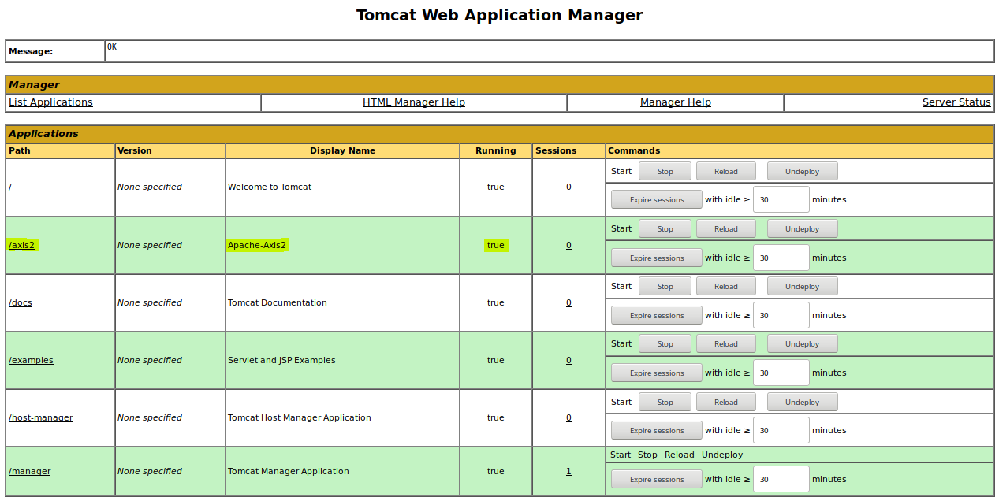

# WebServices-Hello-World
WebServices Hello World Java Implementation

## Requirements

You must have this software:

```
- Apache Tomcat
- Apache Ant
- Apache Axis2
```

## Execution example

The following scenario is taken as a starting point:

```
shell> tree src/
src/
└── helloapp
    ├── Hello.java
    └── IHello.java

1 directory, 2 files
```

### From Java to WSDL: Defining the service

In order to generate a `WSDL` file from `Hello.class`:

```
shell> ./bin/compileJava.sh 
```
```
shell> ./bin/java2wsdl.sh helloapp.Hello http://localhost:8080/axis2/services/Hello
 ...
[INFO] WSDL created at wsdl/Hello.wsdl
```

```
shell> tree wsdl/
wsdl/
└── Hello.wsdl

0 directories, 1 file
```


### From WSDL to Java: Building the service

Once we got the `WSDL`file, we will be able to generate Java code:

- For **server side**:

```
shell> ./bin/wsdl2java-server.sh wsdl/Hello.wsdl
```

```
shell> tree ./
./
├── build-server.xml
├── resources-server
│   ├── Hello.wsdl
│   └── services.xml
├── src
│   └── server
│       └── ws
│           ├── helloapp
│           │   ├── ExtensionMapper.java
│           │   ├── SayHello.java
│           │   └── SayHelloResponse.java
│           ├── HelloMessageReceiverInOut.java
│           ├── HelloSkeletonInterface.java
│           └── HelloSkeleton.java
...

10 directories, 20 files
```

Now, the code we need to update is in `server.ws.HelloSkeleton`:

```java
 public class HelloSkeleton implements HelloSkeletonInterface {
+    private helloapp.IHello hello;
+    public HelloSkeleton() {
+        hello=new helloapp.Hello();
+    }
    
     public SayHelloResponse sayHello(SayHello sayHello0) {
+        SayHelloResponse response = new SayHelloResponse();
+        response.set_return(hello.sayHello()); 
+        return response;
     }
 }
```

At this point, we can create the `.aar` file we will use to deploy the service in Axis2, which is running on Tomcat:

```
shell> bin/buildService.sh 
...
jar.server:
     [copy] Copying 2 files to build/classes/META-INF
      [jar] Building jar: build/lib/Hello.aar
...
```


- For **client side**:

```
shell> ./bin/wsdl2java-client.sh wsdl/Hello.wsdl
```

```
shell> tree ./
./
├── build-client.xml
├── src
│   ├── client
│   │   └── ws
│   │       ├── HelloCallbackHandler.java
│   │       └── HelloStub.java
...

12 directories, 23 files
```

Now, in order to get a friendly interface, a proxy will be implemented. This proxy will be named `client.HelloWSProxy` and it will implement a copy of interface of the service:

```java
public class HelloWSProxy implements client.IHello{
        private HelloStub stub;
        public HelloWSProxy() throws RuntimeException{
                try {
                        stub=new HelloStub();
                } catch (AxisFault e) {
                        throw new RuntimeException(e);
                }
        }
        @Override
        public String sayHello() throws RuntimeException{
                try {
                        SayHello sayHello=new SayHello();
                        SayHelloResponse response = stub.sayHello(sayHello);
                        return response.get_return();
                } catch (RemoteException e) {
                        throw new RuntimeException(e);
                }
        }
}
```


### Testing the service

First of all, Axis2 has to be listening on `http://localhost:8080/axis2/` :



And our service in `http://localhost:8080/axis2/services/Hello`:


Once `Hello.aar` is deployed in Axis2, we can execute commands from the proxy:

```java
package client;
public class HelloClient {
        public static void main(String[] args) {
                try {
                        client.IHello hello = new HelloWSProxy();
                        System.out.println("> Say Hello");
                        System.out.println(hello.sayHello());
                } catch (RuntimeException e) {
                        System.err.println("[!] Something terrible happened!: "+e.getMessage());
                        //e.printStackTrace();
                }
        }
}
```

```bash
shell> bin/runClient.sh
> Say Hello
Hello World!
```

